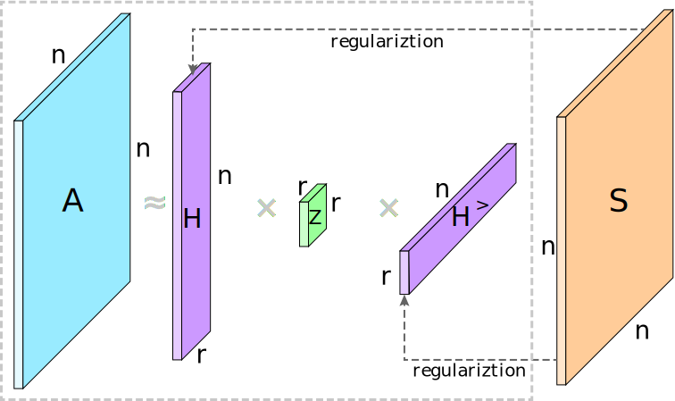

# RAsNMF

  ## Asymmetric Semi-Nonnegative Matrix Factorization for Directed Graph Clustering
  
  Reyhaneh Abdollahi, Seyed Amjad Seyedi, and Mohamad Reza Noorimehr
  
  *10th International Conference on Computer and Knowledge Engineering (ICCKE2020), 323-328*
  
  *https://doi.org/10.1109/ICCKE50421.2020.9303649*

  # Abstract

Graph clustering is a fundamental task in the network analysis, which is essential for many modern applications. In recent years, Nonnegative Matrix Factorization (NMF) has been effectively used to discover cluster structures due to its powerful interpretability property. In this paper, we introduce a clustering algorithm based on Semi-Nonnegative Matrix Factorization that is one of the well-known extensions of NMF. This factorization allows algorithms to capture more accurate (positive and negative) relationships among clusters and, thereby, to derive a latent factor that is even proper for clustering and also has much more responsibility in the regularization. Moreover, to improve the clustering, we define an asymmetric graph regularization to penalize the asymmetric similarity of nodes denoted by cluster memberships. Experimental results on four real-world datasets validate the effectiveness of the proposed method.
